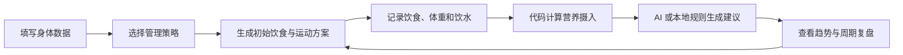

<div align="center">

# 食衡 MealTune

### 轻量饮食、体重与运动建议工具

**记录你吃的，调准下一餐。**

[](https://vite.dev/)
[](https://developer.mozilla.org/docs/Web/JavaScript)
[](https://web.dev/progressive-web-apps/)
[](https://developer.mozilla.org/docs/Web/API/IndexedDB_API)
[](https://github.com/MurrayTsai/MealTune/actions/workflows/deploy.yml)

一款面向普通健康成年人的移动端优先 Web App / PWA。  
它根据用户的身体数据、目标与执行偏好生成初始方案，并在用户记录饮食、体重和饮水后，计算当日营养进度，给出下一餐或当天后续饮食建议。

</div>

---

## 项目简介

很多饮食记录产品能够告诉用户“今天吃了多少”，但仍然没有回答更重要的问题：

> **我还差什么？下一餐应该怎么调整？**

MealTune 将营养计算、轻量记录和 AI 建议组合成一个完整闭环：



产品不追求复杂的专业营养功能，而是让用户通过记录食物克数，快速理解：

- 今天摄入了多少热量、蛋白质、碳水、脂肪和膳食纤维；
- 当前距离目标还差多少；
- 下一餐应优先补充什么、减少什么；
- 体重变化是短期波动，还是已经形成稳定趋势。

---

## 三类用户策略

MealTune 不使用同一套方案服务所有用户，而是根据执行偏好提供三种策略。

| 策略 | 适合人群 | 热量方向 | 蛋白质参考 | 建议重点 |
|---|---|---:|---:|---|
| 运动配合减脂 | 愿意规律运动，希望饮食限制相对温和 | 维持热量约 -10%～15% | 1.6～1.8 g/kg | 运动前后饮食、恢复、蛋白质与碳水配平 |
| 饮食优先减脂 | 不想执行复杂训练，主要依靠饮食控制 | 维持热量约 -15%～20% | 1.4～1.6 g/kg | 热量空间、低脂蛋白质、蔬菜与执行便利性 |
| 健康饮食管理 | 不以明显减重为首要目标，希望改善结构 | 维持热量约 95%～105% | 1.0～1.2 g/kg | 饮食均衡、蔬菜、水果、纤维与长期稳定性 |

三类用户共用同一套页面和记录流程，但初始目标、首页重点、AI 建议角度与复盘标准不同。

---

## 核心功能

### 1. 首次设置与初始方案

用户填写年龄、生理性别、身高、当前体重、目标体重和活动水平，并选择适合自己的管理策略。系统使用规则计算：

- 估算静息能量消耗；
- 估算每日维持热量；
- 每日热量范围；
- 蛋白质、碳水和脂肪目标；
- 膳食纤维、蔬菜、水果和饮水目标；
- 第一阶段体重目标；
- 与用户类型匹配的轻量运动建议。

所有结果均为初始估算，需要结合持续记录和长期趋势进行校准。

### 2. 饮食记录

支持两种记录方式：

- **自然语言输入**：例如“午餐吃了 200 克米饭、150 克鸡胸肉和 300 克西兰花”；
- **手动搜索添加**：从本地基础食物库选择食物并输入重量。

当前仓库内置 **65 项基础食物数据**，覆盖主食、蛋白质食物、蔬菜、水果、脂肪来源、豆制品、调味品和零食等类别。

### 3. 营养进度计算

营养事实不由大模型生成，而是由本地食物数据库和代码计算：

```text
某营养素摄入量 = 每 100 克营养值 × 实际重量 ÷ 100
本餐营养 = 本餐全部食物营养之和
当日营养 = 当日全部餐次营养之和
```

系统展示热量、蛋白质、碳水、脂肪和膳食纤维的当前值、目标范围与完成状态。

### 4. AI 饮食建议

AI 在 MealTune 中承担两个任务：

1. 将自然语言饮食描述解析为结构化食物记录；
2. 根据代码已经计算好的营养状态，生成下一步饮食建议。

AI **不负责重新计算营养数值，也不能自行修改用户目标**。当在线模型不可用时，应用会回退到本地关键词解析与规则建议，保证基础记录能力仍可使用。

### 5. 体重、饮水与趋势

- 每日体重记录；
- 饮水快捷记录；
- 7 天与 30 天趋势切换；
- 体重、热量和蛋白质图表；
- 数据不足状态提示；
- 周复盘与月复盘页面。

产品优先关注多日趋势，不根据单日体重波动频繁调整方案。

### 6. 本地优先与 PWA

- 无需注册账号；
- 核心数据保存在当前设备的 IndexedDB；
- 支持 Service Worker 和 Web App Manifest；
- 可作为移动端网页使用，也可安装为 PWA；
- 刷新或重新打开后，已保存数据仍然存在。

---

## AI 与规则的职责边界

MealTune 采用“**规则负责事实，AI 负责理解与表达**”的设计。


| 模块 | 负责内容 | 不负责内容 |
|---|---|---|
| AI 食物解析 | 识别食物名称、重量、单位和餐次 | 编造热量与营养事实 |
| 本地食物库 | 提供标准化营养数据 | 判断用户应该怎么吃 |
| 营养计算规则 | 计算本餐、当日和剩余目标 | 生成开放式自然语言建议 |
| AI 决策建议 | 将结构化结果转化为可执行建议 | 修改方案目标、绕过过敏限制或诊断疾病 |

---

## 当前实现状态

本仓库是 MealTune V1 的可运行原型，已经实现主要演示闭环。

| 模块 | 当前状态 |
|---|---|
| 首次设置与三类方案 | 已实现 |
| 营养目标计算 | 已实现 |
| 手动添加食物 | 已实现 |
| 自然语言饮食解析 | 已实现在线模型调用与本地回退 |
| 本地食物数据库 | 已实现，当前 65 项 |
| 餐次保存与每日汇总 | 已实现 |
| 体重与饮水记录 | 已实现 |
| 今日营养进度 | 已实现 |
| AI / 规则饮食建议 | 已实现 |
| 7 天与 30 天趋势 | 已实现 |
| 周复盘与月复盘 | 已实现基础页面与逻辑 |
| IndexedDB 本地保存 | 已实现 |
| PWA 与 Service Worker | 已实现 |
| GitHub Pages 自动部署 | 已配置工作流 |

下一阶段重点是提升 AI 结构化输出稳定性、完善食物生熟状态与别名、加强过敏硬过滤、增加自动化测试，并将模型调用迁移到服务端代理。

---

## 技术栈

| 层级 | 技术 |
|---|---|
| 前端 | Vanilla JavaScript、HTML、CSS |
| 构建工具 | Vite 6 |
| 路由 | 自定义 Hash Router |
| 本地数据库 | IndexedDB + Dexie 4 |
| 图表 | Chart.js 4 |
| AI 接口 | OpenAI-compatible Chat Completions API |
| 离线能力 | Web App Manifest + Service Worker |
| 部署 | GitHub Actions + GitHub Pages |

项目没有引入 React、Vue 等大型框架，适合作为轻量移动端 Web App 原型继续迭代。

---

## 项目结构

```text
MealTune/
├── .github/
│   └── workflows/
│       └── deploy.yml          # GitHub Pages 自动部署
├── public/
│   ├── icons/                  # PWA 图标
│   ├── manifest.json           # Web App Manifest
│   └── sw.js                   # Service Worker
├── src/
│   ├── components/
│   │   └── shared.js           # 通用 UI 组件
│   ├── data/
│   │   ├── db.js               # Dexie / IndexedDB 数据层
│   │   └── foodDatabase.js     # 本地食物数据库
│   ├── pages/
│   │   ├── onboarding.js       # 首次设置
│   │   ├── today.js            # 今日页面
│   │   ├── records.js          # 饮食记录
│   │   ├── trends.js           # 趋势图表
│   │   ├── weekly-review.js    # 周复盘
│   │   ├── monthly-review.js   # 月复盘
│   │   └── me.js               # 我的与设置
│   ├── styles/                 # 页面与全局样式
│   ├── utils/
│   │   ├── aiService.js        # AI 调用、本地解析与建议回退
│   │   └── nutrition.js        # 营养方案和状态计算
│   ├── main.js                 # 应用入口
│   └── router.js               # Hash Router
├── index.html
├── package.json
├── pnpm-lock.yaml
└── vite.config.js
```

---

## 本地运行

### 环境要求

- Node.js 20 或更高版本；
- pnpm。

### 安装与启动

```bash
git clone https://github.com/MurrayTsai/MealTune.git
cd MealTune
pnpm install
pnpm dev
```

开发服务器默认运行在：

```text
http://localhost:3000
```

### 构建生产版本

```bash
pnpm build
```

构建结果会输出到 `dist/` 目录。

### 本地预览构建结果

```bash
pnpm preview
```

---

## AI 配置

进入应用中的：

```text
我的 → AI 配置
```

可填写：

- API Key；
- API Endpoint；
- 模型名称。

默认接口格式兼容 OpenAI Chat Completions API。未配置接口或请求失败时，应用会自动使用本地关键词解析和规则建议。

> [!WARNING]
> 当前原型会将 AI 配置保存在浏览器本地，并由前端直接请求模型接口，仅适合个人本地测试和产品演示。正式部署时应使用 Serverless Function 或独立后端代理模型请求，不应在公开前端中暴露长期有效的 API Key。

---

## 数据与隐私

- 用户不需要注册账号；
- 身体数据、饮食记录、体重记录、方案和复盘默认保存在浏览器 IndexedDB；
- 清除浏览器网站数据后，历史记录可能无法恢复；
- 使用在线 AI 时，当前输入文本及完成任务所需的结构化信息会被发送至用户配置的模型服务；
- 产品不需要姓名、住址、联系人或精确位置。

在正式上线前，建议进一步增加数据导出、备份恢复、隐私政策和模型服务说明。

---

## 部署说明

仓库已配置 GitHub Actions，在 `main` 分支更新后自动执行：

```text
安装依赖 → Vite 构建 → 上传 dist → 部署 GitHub Pages
```

当项目部署在 `https://<username>.github.io/MealTune/` 这类子路径时，需要确认 Vite 的 `base` 配置、Service Worker 注册地址和静态资源路径与仓库名称一致。

例如：

```js
// vite.config.js
export default {
  base: '/MealTune/',
  // ...
}
```

使用自定义域名或部署在站点根目录时，应根据实际路径调整该值。

---

## 产品原则

1. **轻量**：首页聚焦今日状态和下一步行动，降低首次设置与每日记录成本。
2. **可信**：营养事实来自食物数据库与代码计算，AI 不编造数值。
3. **可确认**：AI 解析结果应由用户确认后再进入正式记录。
4. **本地优先**：没有账号和云服务时，核心记录与计算仍然可用。
5. **趋势优先**：依据多日平均与周期数据判断效果，不放大单日波动。
6. **非惩罚式设计**：不使用羞辱、失败或强迫补齐数字的文案驱动用户。

---

## V1 范围边界

MealTune 当前定位为普通健康管理工具，不包含：

- 疾病诊断、治疗或医疗营养处方；
- 保证减重效果或“精准代谢”承诺；
- 人体真实营养吸收率计算；
- 专业训练周期、动作识别或康复计划；
- 根据运动手表热量实时返还饮食额度；
- 餐馆菜、外卖和复杂混合菜的精准自动估算；
- 云同步、社区、会员和多设备数据合并。

---

## 后续计划

- [ ] 使用严格 JSON Schema 提高食物解析稳定性；
- [ ] 增加解析结果确认、低置信度候选与生熟状态校验；
- [ ] 扩充食物数据、中文别名和常见单位换算；
- [ ] 完善过敏、忌口与健康限制的硬过滤；
- [ ] 将 AI 请求迁移至 Serverless / 后端代理；
- [ ] 完善 7 日平均体重与阶段目标参考线；
- [ ] 增加单元测试、端到端测试和 AI Bad Case 测试集；
- [ ] 增加数据导出、导入与本地备份；
- [ ] 补充项目截图、交互演示和产品设计说明。

---

## 健康声明

MealTune 基于用户输入、标准食物营养数据和一般健康规则提供摄入估算与生活方式建议，仅用于普通健康管理参考，不能替代医生、注册营养师或其他专业人员的诊断与治疗。

如用户存在医生要求的饮食或运动限制，应优先遵循专业人员建议。

---

## 开源说明

本仓库目前未声明开源许可证。在复制、修改、分发或用于商业项目前，请先联系项目作者；若计划开放外部协作，建议补充合适的 `LICENSE` 文件。

---

<div align="center">

**食衡 MealTune — 记录你吃的，调准下一餐。**

</div>
